# Multideck email signatures

The signature belongs to the email authored in Multideck. It is resolved centrally at send time and previewed through the same control in Inbox, Dexter, contact popups and quote issue emails. Provider settings are not modified.

```mermaid
flowchart LR
  A[Admin opens Email signatures] --> B[Choose a layout]
  B --> C[Drag rows and blocks\nEdit details, logo and banner]
  C --> D[Draft autosaves]
  D --> E[Preview as an employee]
  E --> F[Assign everyone, departments or people]
  F --> G[Review and apply\nPublished version]
  G --> H[Open any Multideck composer]
  H --> I[Resolve individual → department → everyone]
  I --> J[Choose signature or mailbox default]
  J --> K[Preview / toggle off for this email]
  K --> L[Server checks access and reviewed version]
  L --> M[HTML + plain text + CID images]
  L -->|Changed| K
```

Permitted users can create independent personal copies. The company allows customisation by default, with per-person overrides. Restricted users retain the per-email on/off control. Multiple department matches remain choices; an individual assignment overrides department matches. Defaults are per user and mailbox. Dynamic values use the active employee, the actual sending mailbox address, the employee's first alphabetically sorted linked office address, and company settings. Empty values are omitted. Telephone/mobile overrides live in signature profiles; core staff identity stays in Team.

## Editing and movement

The builder uses one- and two-column rows. Identity, contact, text, image, social link, divider, spacing and reviewed-import blocks share a portable document contract. Custom SVG miniatures communicate each block's content. Pointer pickup begins after 5px; movement drives up to 5 degrees of tilt. The insertion gap, raised preview and spring settle reinforce where the block is going. Click-to-add, move buttons, Alt + arrows, row moves, undo/redo and Escape provide alternatives. Reduced motion removes lift/tilt and animated displacement. Motion is limited to the editing interface, never outgoing email markup.

Mobbin references consulted: [Mailchimp editor](https://mobbin.com/screens/ed0abfb5-b275-45ab-852b-b14bdd208ab5), [Klaviyo editor](https://mobbin.com/screens/860ec846-efe7-4e67-b3e5-5f69b30ad3b2), [Customer.io editor](https://mobbin.com/screens/f822b177-ce70-4b2b-bc03-cdec85f3dca7). These informed a compact block palette, central email canvas and progressive properties inspector.

## Import and existing providers

Gmail import reads the selected authorised send-as alias using [sendAs.get](https://developers.google.com/workspace/gmail/api/reference/rest/v1/users.settings.sendAs/get). Missing access offers reconnect or paste; there is no writeback. Outlook uses a reviewed portion of a recent authorised sent email or a formatted paste. Microsoft's published [mailboxSettings contract](https://learn.microsoft.com/en-us/graph/api/resources/mailboxsettings?view=graph-rest-1.0) has no signature property.

Imported formatting becomes one sanitised block, with executable markup, remote images and tracking pixels removed. The operator is told to upload logos/banners as managed image blocks. Importing an email requires removing message and quoted content before adding the reviewed signature. Imports are saved copies, not live synchronisation or a full editable conversion into native blocks.

WiseStamp browser/add-in signatures remain managed there for Outlook/Gmail. Its [server-side rules](https://support.wisestamp.com/en/articles/12561471-server-side-signature-rules-for-email-management) may add a second signature after Multideck sends. A tenant using server-side insertion needs an appropriate provider exclusion and real delivery verification before rollout. Multideck does not claim to bypass external insertion, and its toggle only controls its own signature.

## Persistence, permissions and sending

Incremental migrations create service-only, RLS-enabled records for policies, profiles, templates, versions, assets, defaults and audit events. The private `email-signatures` bucket accepts raster images up to 2 MB each; one signature can reference eight images totalling 10 MB. Full email attachments plus images cannot exceed 15 MB. Assets are company/owner checked, previewed through short-lived signed URLs and sent as CID MIME resources. Unassigned company assets are not listed to ordinary users.

Draft saves never mutate published documents or assignments. Commit uses expected revisions, row and company transaction locks. Published versions and audit evidence are written atomically. Policy changes cannot remove the last company default while customisation is restricted. Personal copies retain their saved source content after source edits or unassignment. Recovery uses per-user session storage; conflicts retain content as a recovered draft.

Composers store signature ID, revision, enabled state and a fingerprint covering resolved personal values. Saved Multideck drafts can be reopened by their author with mailbox send access, preserving the signature toggle and exact recipient additions/removals. Provider drafts retain their separate provider flow; legacy replies without recipient-edit metadata are not reconstructed. Server send rejects a changed or no-longer-eligible signature before submitting mail; the operator refreshes the preview or turns it off. The signature is added above forwarded content. Gmail carries plain/HTML alternatives with related CID resources; Outlook uses HTML and inline file attachments. Provider-draft sends inspect inline files even when Graph reports no ordinary attachments. Existing idempotency and approval boundaries remain in use.

Authentication/system emails and automatic quote follow-ups retain their existing templates. The automated follow-up worker explicitly opts out of an interactive signature; it cannot approve a newly assigned design on someone's behalf.

## Dexter

`email_signatures` provides tenant-safe names, current published revisions, personal status and permitted assignment evidence, with source IDs and citations. Deterministic watches follow one accessible signature's published revision; assignment watches require signature-manager permission. A publication fires once per commit; draft autosaves do not trigger. Permission/eligibility is rechecked at evaluation and resume.

**Explicit unsupported write exception:** chat cannot create, restyle, publish, assign or alter signature policy. These changes currently require a visual layout/audience review which the generic action approval UI cannot faithfully show. Dexter links the actual signature builder instead of offering an unreviewable write. Watch actions notify only, with no LLM polling or automatic signature changes. Email-send approval still includes the exact reviewed signature choice through the existing email action flow.

Company details are managed in Admin > Email signatures > Team details, stored with the company signature policy, and rendered through the shared Company details field. Preview and all composer/send consumers resolve the same values. Edits are manager-only, revision-checked and audited as policy changes. Dexter company-details reads, writes and dedicated change watches are currently unsupported: use the Admin form; the existing signature-publication watch does not claim to monitor policy details. Dexter email previews and sends do resolve the latest company details and include them in the approved signature fingerprint.

## Activation and verification

Apply `20260911143000_email_signature_builder.sql`, `20260911144000_dexter_signature_draft.sql`, then `20260911145000_email_signature_dexter_parity.sql` to the intended tenant after preceding migrations. Deploy `inbox-api`, `agent-dexter`, `quotes-workflow` and `email-watch-worker`, then the client. Provisioning must include the shared portable TypeScript contract in the function bundle.

Local evidence: PostgreSQL real persistence/access and deterministic watch lifecycle; shared renderer/import/send resolution tests; mocked Gmail/Outlook transport contracts; existing Inbox draft and recipient tests; frontend type/build checks; Chrome component interaction review. The full access regression suite passed after activation (25 primary and 10 secondary tests). The draft-resume change passed nine signature/backend tests and 59 client Inbox contract tests. The client production build passed.

Approved activation, 11 September 2026: all three signature migrations were applied to **MultiDeck** (`aqtwypsuijxlnvtxpuxe`), the backend used by localhost and dev.multideck.app. All seven signature tables have RLS and deny direct authenticated SELECT; the asset bucket is private. Existing function JWT settings were preserved: `inbox-api`, `agent-dexter` and `quotes-workflow` enabled; `email-watch-worker` disabled with its existing worker authentication. Scoped releases were assembled from deployed bundles to preserve concurrent tracking work and exclude unrelated local CRM/quote changes. Downloaded source matched every intended file: Inbox 122, Dexter 237, quotes 85 and watch worker 85. The separate Jenkar production project was untouched. The frontend has not been published by this task.

Connected Chrome evidence: create → autosave → upload logo → publish to the tester only → reload; actual sending-mailbox identity in the preview; toggle off → save draft → reload → Edit saved draft retained both the off state and recipient; personal copy → publish → persisted source/owner/version; Gmail signature import returned sanitised formatting and an image-removal explanation. No provider signature setting was changed. See [the dated delivery evidence](../qa/email-signatures-2026-09-11.md).

Before wider tenant rollout, verify an ordinary restricted user's real UI session and physical cross-project credential denial. Their permission/eligibility cases pass the isolated PostgreSQL regression suite, but those tests do not constitute a second live tenant session. Native Outlook/Apple Mail rendering and external server-side signature exclusions remain tenant-specific checks.

Chrome at 390 × 844: selecting a block opens the properties sheet; Close returns focus to the palette control used to add it, and Escape returns focus to an existing block's edit control. Temporary viewport overrides were cleared after checking. The component gallery is a local editing preview and does not prove connected template persistence.
